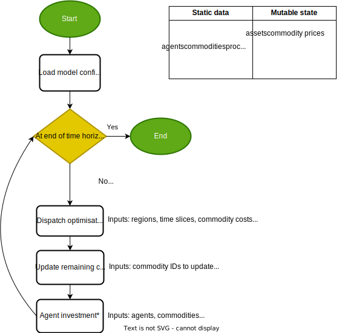
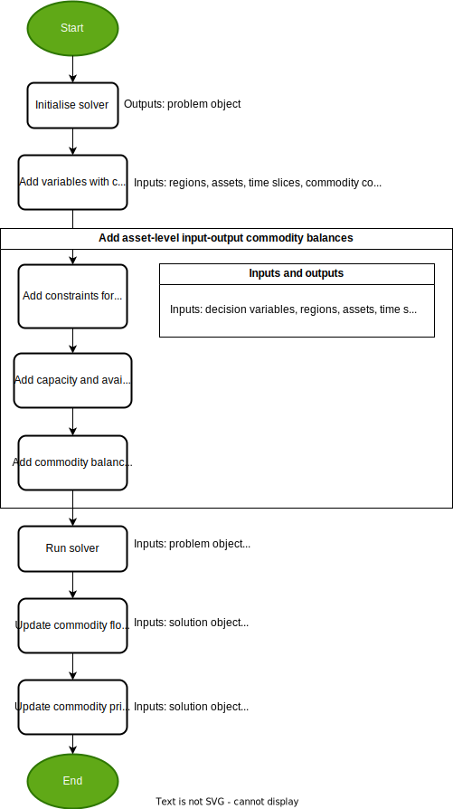

<!-- markdownlint-disable MD033 -->
# Model diagrams

This document contains diagrams showing the algorithm used by MUSE 2.0. It is likely to contain
errors and omissions and will change as the code is developed. It is principally aimed at MUSE
developers.

<figure>
    
    <figcaption>Figure 1: Overview of MUSE 2.0 algorithm</figcaption>
</figure>

<figure>
    
    <figcaption>Figure 2: Overview of dispatch optimisation</figcaption>
</figure>

